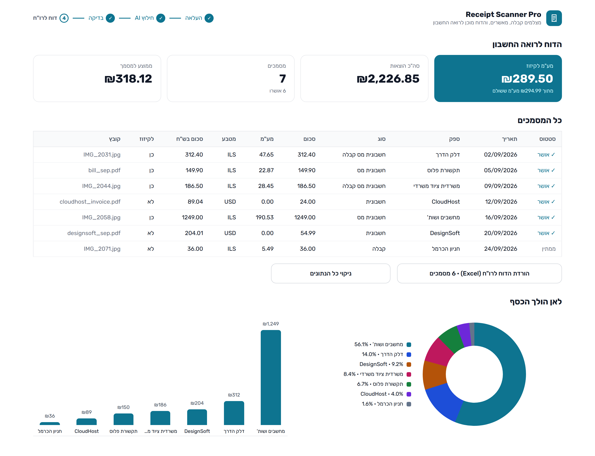
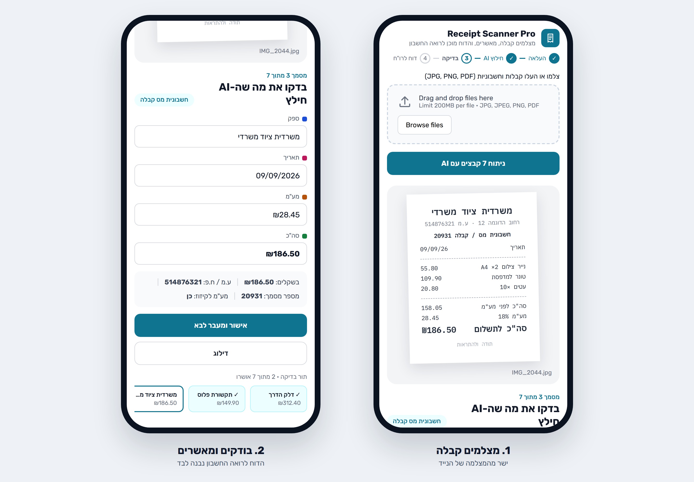

# 🧾 Receipt Scanner Pro

**For Israeli freelancers and small businesses (עוסק מורשה) who need to get their receipts to their accountant.**
Photograph receipts and invoices on your phone or upload them from your computer. Claude AI extracts the details, you approve each document, and you download a tidy Excel report for your accountant.

## Screenshots





*Screenshots use sample data.*

## How it works

1. **Upload**: photograph receipts with your phone's camera or upload JPG, PNG or PDF files, several at once. Phone photos are rotated upright and resized automatically.
2. **AI extraction**: each document is analyzed in parallel with Claude, which extracts:
   - vendor
   - date (Israeli day-first dates are handled)
   - total
   - VAT (מע"מ)
   - currency
   - business ID (ע.מ / ח.פ)
   - document type (חשבונית מס, קבלה, ...)
   - document number

   PDFs are sent as documents, so every page is read.
3. **Review**: the original image is shown next to the extracted fields. Approve each document; your approvals are saved.
4. **Report for the accountant**: the Excel file includes only approved documents, sorted by date, in a right-to-left sheet. It has real dates and these columns:
   - net, VAT and gross amounts
   - the amount in shekels
   - VAT that can be reclaimed
   - a totals row

## What makes the numbers trustworthy

- **VAT to reclaim** counts only Israeli tax invoices (חשבונית מס / חשבונית מס קבלה) in shekels with a 9-digit business ID. A plain receipt or a foreign invoice doesn't count. The app also shows the total VAT paid.
- **Currencies**: foreign amounts are converted to shekels when the document is scanned, using live rates for every currency, cached hourly. An unknown currency is flagged; it is never silently treated as shekels.
- **Duplicates**: re-uploading the same file is caught before any API call. The same document from another photo is caught by its vendor, date, amount, currency and document number. Two documents that look the same but have no number to tell them apart are both kept, and flagged for you to check.
- **Nothing is lost silently**: every file ends up with a visible result. It is either saved, possibly a duplicate, a duplicate, rejected (with the reason) or failed (with the error).

## Setup

Requires Python 3.9+ and an [Anthropic API key](https://console.anthropic.com/).

```bash
pip install -r requirements.txt
```

Create `.streamlit/secrets.toml` (it is gitignored):

```toml
ANTHROPIC_API_KEY = "your-api-key"
```

For Streamlit Community Cloud, add the key in the app's Secrets settings instead.

Then run:

```bash
streamlit run app.py
```

The app opens at `http://localhost:8501`. To use it from your phone, open the same address on your local network (`http://<your-computer-ip>:8501`).

## Privacy

- Receipt images are sent to the Anthropic API for extraction. Only the extracted fields are stored, locally, in `receipts.db`.
- The app is designed for **one user on their own computer**. Do not deploy it publicly as-is: every visitor would share the same database and your API key.
- `.streamlit/config.toml` binds the app to `localhost`, so other devices on the same network cannot open it, and hides Python error details from the browser.
- Text from receipts is written to Excel as plain text, never as a formula, so a crafted receipt cannot plant a link or formula in the accountant's file.
- The database and exported reports (`*.db`, `*.xlsx`) are gitignored.

## Development

```bash
pip install -r requirements.txt -r requirements-dev.txt
ruff check .
pytest
```

The tests cover parsing, validation, VAT rules, duplicates, currency conversion, storage and the Excel report. They use a fake Claude client, so no API key is needed. The UI is tested headlessly with Streamlit's `AppTest`. GitHub Actions runs everything on every push.

## Tech stack

Streamlit · Anthropic Claude · Pandas · Plotly · PyMuPDF · Pydantic · SQLite · XlsxWriter · RapidFuzz

## License

MIT, see [LICENSE](LICENSE).
